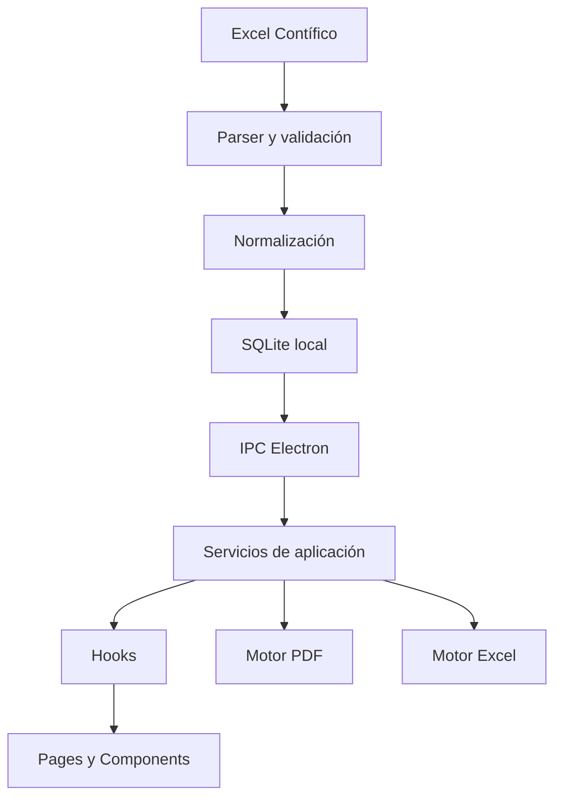

# CAR-ADR-0001 — Architecture Overview

- **Estado:** Aprobado para implementación incremental
- **Fecha:** 2026-08-02
- **Proyecto:** Cartera Dashboard
- **Decisión:** Adoptar una arquitectura modular por responsabilidades, preservando el funcionamiento actual.

## Contexto

Cartera Dashboard es una aplicación de escritorio construida con React, TypeScript, Vite y Electron. Usa SQLite mediante `better-sqlite3`, importa archivos de Contífico con SheetJS y genera reportes PDF con jsPDF y jspdf-autotable.

La aplicación ya incluye importación, validación de cartera, dashboard ejecutivo, gestión de cobranza, promesas de pago, análisis, alertas, tendencias, estados de cuenta y exportaciones PDF/Excel. El archivo `src/App.tsx` concentra todavía gran parte de la interfaz, estados, cálculos, filtros, acceso a APIs, exportaciones y reglas de presentación.

## Problema

La concentración de responsabilidades aumenta:

- el riesgo de regresiones;
- el tamaño del contexto necesario para modificar una función;
- la duplicación de lógica;
- el acoplamiento entre UI, cálculos y persistencia;
- el costo de mantener y probar nuevas funciones.

## Decisión

Se adopta la siguiente arquitectura objetivo:

```text
Electron Main
    ↓ IPC tipado
Preload / API segura
    ↓
React Application
    ├── pages
    ├── components
    ├── hooks
    ├── services
    ├── utils
    ├── pdf
    ├── excel
    └── types
```

### Flujo principal



## Principios

1. **Preservación funcional:** el refactor no cambia reglas de negocio, resultados ni diseño salvo solicitud explícita.
2. **TypeScript estricto:** evitar `any`; los límites IPC y datos persistidos deben tener contratos tipados.
3. **Electron como frontera de persistencia:** SQLite y sistema de archivos permanecen en el proceso principal.
4. **UI sin acceso directo a infraestructura:** React consume una API expuesta por preload.
5. **Funciones puras para cálculos:** aging, montos, riesgo, filtros y estadísticas deben ser comprobables sin React.
6. **Migración incremental:** cada sprint debe compilar y conservar el comportamiento observable.
7. **Sin duplicación permanente:** el código antiguo se elimina después de validar la nueva implementación.

## Capas objetivo

### 1. Presentación

- `src/pages/`
- `src/components/`

Responsable de renderizar información, capturar acciones y mostrar estados.

### 2. Orquestación de UI

- `src/hooks/`

Responsable de filtros, estado derivado, carga y coordinación de acciones de pantalla.

### 3. Servicios de dominio/aplicación

- `src/services/`

Responsable de cálculos, agregaciones, análisis y preparación de datos.

### 4. Infraestructura de frontend

- `src/pdf/`
- `src/excel/`
- `src/api/` o cliente tipado de Electron

### 5. Infraestructura Electron

- `electron/main.ts`
- `electron/preload.ts`
- `electron/db.ts`
- `electron/importContifico.ts`

## Consecuencias

### Positivas

- Menor tamaño y complejidad de `App.tsx`.
- Mejor reutilización de cálculos.
- Menor riesgo al modificar reportes.
- Contratos más claros entre renderer y Electron.
- Mayor facilidad para pruebas unitarias.

### Costos

- Migración progresiva de funciones existentes.
- Necesidad de definir tipos compartidos.
- Revisión cuidadosa de dependencias internas.

## Criterios de aceptación

- `pnpm build` finaliza sin errores.
- La importación de Contífico mantiene sus resultados.
- Los totales y KPIs coinciden con la versión anterior.
- Los reportes PDF/Excel mantienen datos y filtros.
- `App.tsx` deja de contener lógica compleja de reportes y análisis.
