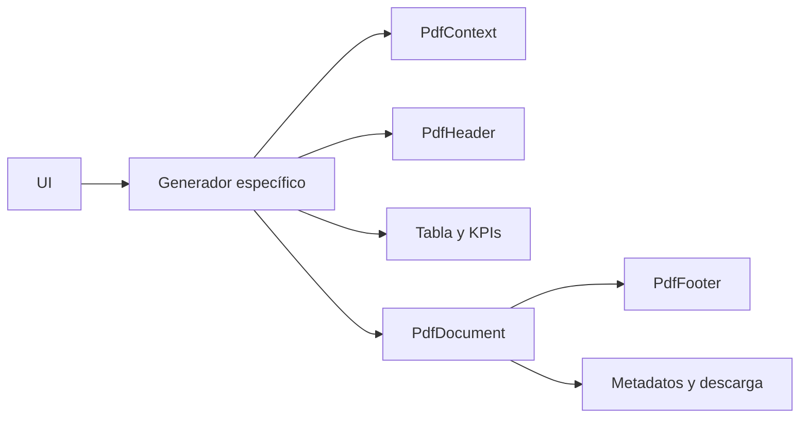

# CAR-ADR-0003 — Report Engine

- **Estado:** Implementado parcialmente y aprobado como estándar
- **Fecha:** 2026-08-02
- **Decisión:** Centralizar identidad visual, contexto, carga de librerías, guardado y metadatos PDF.

## Contexto

Los reportes originalmente construían de manera independiente:

- cabecera;
- logo;
- empresa;
- RUC;
- usuario;
- fecha;
- paleta;
- pie de página;
- paginación.

Esto produjo inconsistencias entre reportes.

## Implementación base existente

```text
src/pdf/
├── core/
│   ├── pdfContext.ts
│   ├── pdfDocument.ts
│   ├── pdfFooter.ts
│   ├── pdfHeader.ts
│   ├── pdfTheme.ts
│   └── pdfTypes.ts
├── reports/
└── index.ts
```

El contexto obtiene actualmente el usuario responsable desde `empresa.administrador`, evitando escribir nombres directamente en el reporte.

## Arquitectura del motor



## Responsabilidades

### Core

- `pdfContext.ts`: normaliza empresa, RUC, logo, usuario y fecha.
- `pdfHeader.ts`: dibuja cabecera corporativa única.
- `pdfFooter.ts`: agrega usuario, fecha y paginación.
- `pdfDocument.ts`: carga jsPDF/AutoTable, establece metadatos y guarda.
- `pdfTheme.ts`: concentra colores, márgenes y dimensiones.
- `pdfTypes.ts`: contratos compartidos.

### Reports

Cada generador conserva únicamente:

- título específico;
- KPIs del reporte;
- columnas;
- filas;
- agrupaciones;
- colores particulares;
- filtros recibidos;
- nombre del archivo.

## Reportes objetivo

```text
carteraReport.ts
promesasReport.ts
analisisReport.ts
abonosReport.ts
alertasReport.ts
tendenciasReport.ts
estadoCuentaReport.ts
gestionReport.ts
```

## Reglas

1. Ningún reporte nuevo debe dibujar cabecera o pie manualmente.
2. Ningún reporte debe leer directamente estados React.
3. Los generadores reciben DTOs preparados.
4. Los totales deben calcularse mediante funciones compartidas cuando sean equivalentes.
5. Todo reporte debe incluir empresa, RUC disponible, usuario y fecha.
6. Si el RUC no está configurado, se omite de forma uniforme.

## Deuda técnica pendiente

- Extraer tarjetas KPI comunes a un helper compartido si la forma se mantiene estable.
- Normalizar tablas y estilos repetidos sin ocultar configuraciones específicas.
- Completar tipado de todas las filas de reportes.
- Añadir pruebas de totales y ordenamiento.

## Criterios de aceptación

- No quedan cabeceras o pies duplicados en `App.tsx`.
- Todos los reportes muestran la misma identidad.
- Los generadores pueden ejecutarse sin renderizar una página React.
- Los archivos exportados conservan filtros y totales.
