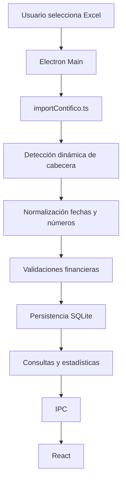

# CAR-ADR-0004 — Data Pipeline and Persistence

- **Estado:** Aprobado; refactor futuro controlado
- **Fecha:** 2026-08-02
- **Decisión:** Mantener SQLite y procesamiento de archivos en Electron; formalizar el pipeline de importación y los contratos IPC.

## Pipeline actual



## Componentes existentes

### `electron/importContifico.ts`

Contiene:

- normalización de encabezados;
- conversión de fechas;
- saneamiento numérico;
- búsqueda dinámica de la fila de cabecera;
- importación del Excel;
- cálculo y registro de descuadres.

### `electron/db.ts`

Contiene:

- apertura de SQLite;
- creación/evolución del esquema;
- resolución de la ubicación del archivo de base de datos.

### `electron/main.ts`

Concentra numerosos handlers IPC para:

- documentos;
- empresa;
- gestiones;
- promesas;
- alertas;
- tendencias;
- abonos;
- respaldos;
- importación;
- configuración y red.

## Reglas de negocio preservadas

```text
Suma de tramos = Por vencer + 1-30 + 31-60 + 61-90 + >90
```

Se registra descuadre cuando:

```text
|Total reportado - suma de tramos| > 0,01
```

Los valores faltantes deben sanearse a cero cuando corresponda y nunca romper la importación por sí solos.

## Decisión

- SQLite permanece exclusivamente en Electron.
- React no abrirá bases de datos directamente.
- La importación seguirá detectando cabeceras por nombre y no por posición fija.
- Se crearán contratos IPC tipados compartidos.
- `electron/main.ts` se dividirá por dominios únicamente después de estabilizar el renderer.

## Arquitectura objetivo de Electron

```text
electron/
├── main.ts
├── preload.ts
├── db/
│   ├── connection.ts
│   ├── schema.ts
│   └── migrations.ts
├── repositories/
│   ├── documentosRepository.ts
│   ├── gestionesRepository.ts
│   ├── empresaRepository.ts
│   └── abonosRepository.ts
├── services/
│   ├── importContificoService.ts
│   ├── analyticsService.ts
│   └── backupService.ts
└── ipc/
    ├── documentosHandlers.ts
    ├── gestionesHandlers.ts
    ├── reportesHandlers.ts
    └── configHandlers.ts
```

## Restricción

Esta separación no debe ejecutarse en el mismo sprint que la división completa de páginas React. Se considera una etapa posterior para reducir el riesgo.

## Criterios de aceptación

- No cambia la ubicación de la base de datos sin migración explícita.
- No se pierden datos existentes.
- Las importaciones anteriores siguen siendo compatibles.
- Los handlers mantienen nombres y respuestas mientras el renderer dependa de ellos.
- Las migraciones de esquema son idempotentes.
